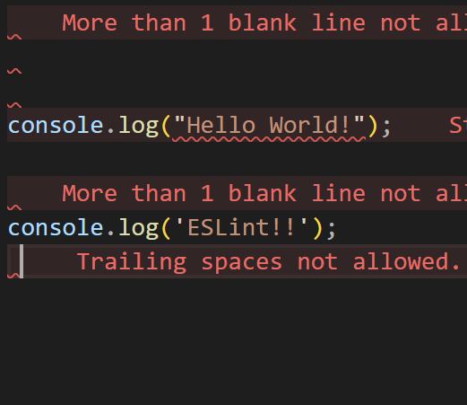

### ESLint Squiggles
To me, ESLint has been pretty useful in making my code, as it allows me to have a clear formatting framework which is customizable to my liking. I could definitely see how it would be useful when working on a project with other people, as people often have very different styles of coding, and using ESLint would allow everyone to have more readable, consistent code. I'm still new to ESLint, so some errors do kind of confuse me, but I've been learning a lot more about formatting and stuff. I use to be one of those people who didn't really care about formatting or readability, and would just code however I want, but after using ESLint I understand how important coding standards are, as it helps you find mistakes easier and understand what segments of code do. 

### Using VSCode
I've used VSCode before, but I am still fairly new to it, as there are a ton of customizable settings and extensions, so I think it'll just take me time to get used to. I definitely think I should organize my files better, as when opening stuff in VSCode I usually have to go on an adventure to find the files I want to. I also am not used to having to save things all the time, as I'm used to stuff autosaving, so I'll often run something, get confused, and then realize I didn't run the new saved file. I think all the extensions and stuff compatible with VSCode is also beneficial, as you can do a lot with your code, unlike simple online editors like TypeScript Playground. 

### Coding Standards
Coding is hard, but it's even harder if it's unorganized. Like I said before, I used to write super unorganized, messy code, which would often confuse me and make it harder for others to understand. Learning more about tools like ESLint has shown me how important coding standards are, and how helpful it can be when working with others. When learning a language, I think coding standards can help, as it allows you to breakdown your code into more understandable bits, thus improving your understanding of it. I hope to learn more about VSCode and ESLint and how they can be used to improve my code and formatting of it.
