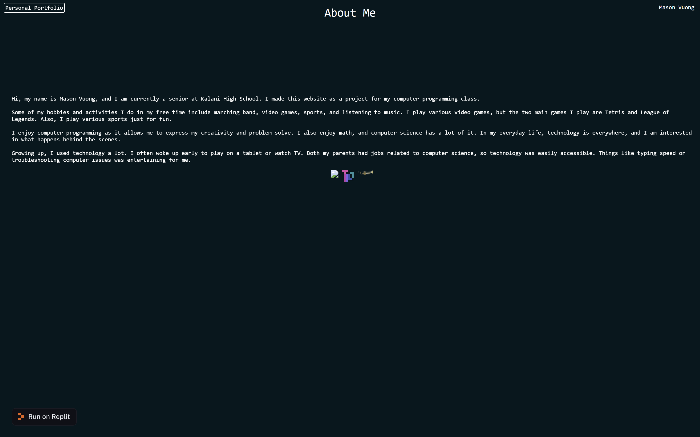
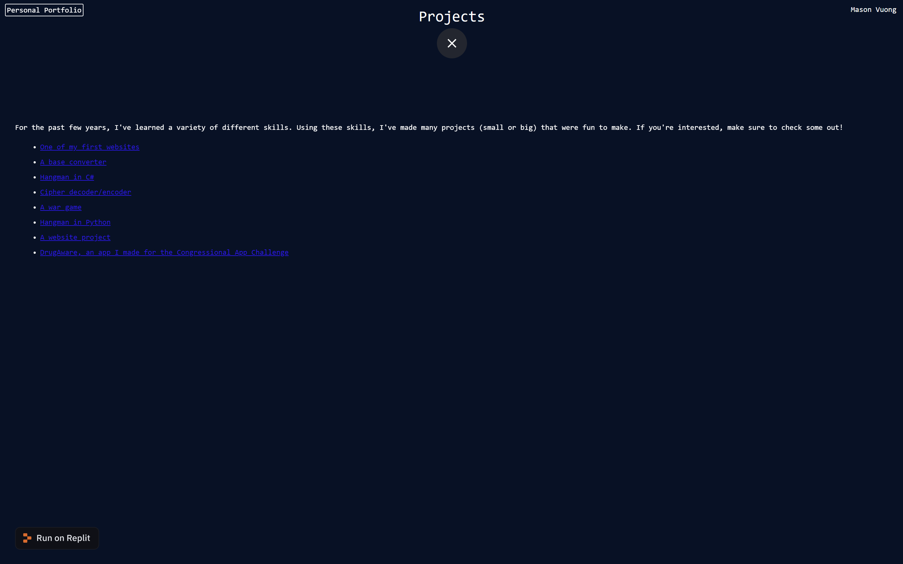
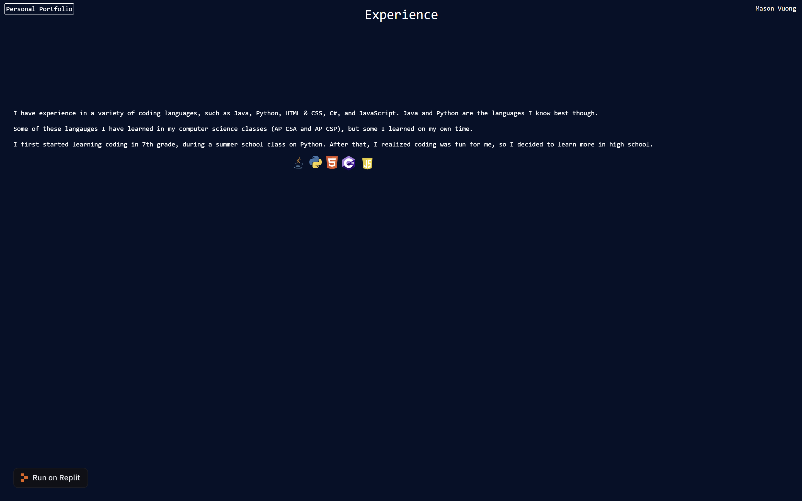
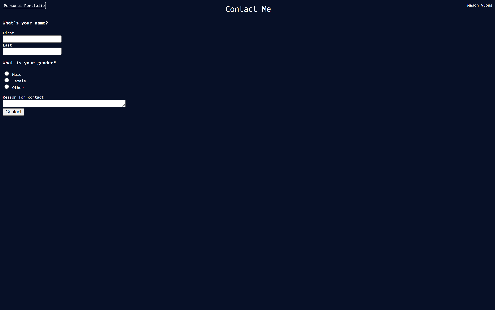

In my senior year of high school, I decided to make a website containing information about me, contact information, and past projects I made in order to learn more about HTML, CSS, and Javascript. Below are the images of what the website looks like. I don't have a link to the source code as this was made a while ago. 

This project has several pages, mostly about my coding experience and who I am, as well as a form to contact me. This project taught me how to use HTML, CSS, and Javascript when I first started learning to code. 

