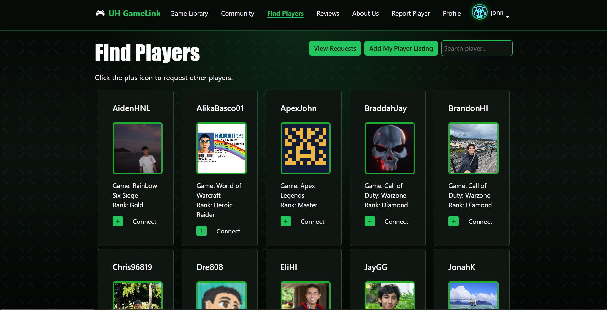

### Overview
UH GameLink is a project I worked on in a group for my Software Engineering class. Our application was created for students who wanted to connect more with other gamers in their community. This application was deployed using Vercel, and has various features, such as browsing games in the game library, joining community discord servers, and connecting with other gamers. The group I was in had a bunch of gamers, so we were all passionate about this project. 

### My Contribution
Overall, my contributions to the project were pretty spread out. I did a little bit of everything, such as coding the webpages, debugging errors, tinkering with the aesthetics, and implementing overall functionality. I'd say the thing I did the most was adjust other people's code to match the overall design of the website. Having 4 different members, there were definitely some clashes in what we envisioned, so I tried my best to connect my team's code to each others'. I also did a lot of debugging. A lot of us were new to using Github to manage a team project, so there were several times where we stepped on each other's toes which caused our application to stop running. Over the course of the project, I made to ensure that the group was on the same page, and we knew to avoid certain issues like committing at the same time or changing certain files. 

### What I Learned
The most important thing I learned was how to work in a team. Of course, I learned a lot about designs and strategies to develop a web application, but I'd say that the teamwork I learned was more valuable. At first, I wasn't sure what to expect, as I didn't really some of my groupmates that well. However, over time I realized that I had a good team, as everyone was very open about their ideas and clear about their work load. I learned from them that communicating in a clear, concise, and respectful manner helped us make good decisions and be on the same page. There was a lot of work to do, so splitting it up between group members was very efficient, and if someone finished faster than the others they could help them. 

Here is an image of the Find Players page:

[Link to application](https://uh-gamelink.vercel.app)  

[Link to Github Organization](https://github.com/uh-gamelink)
